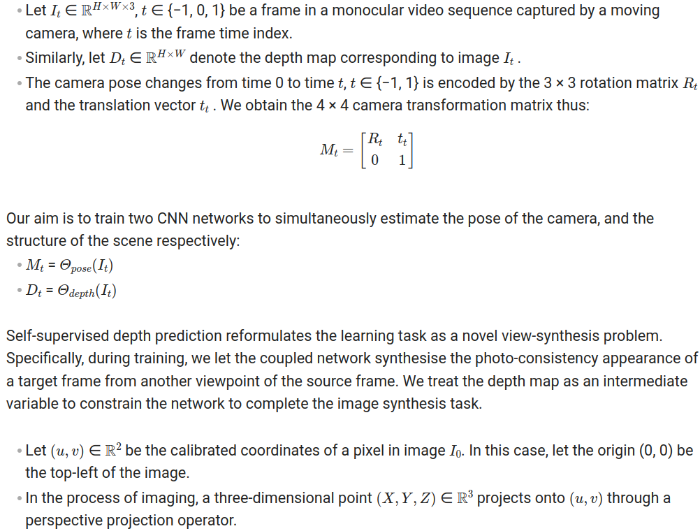
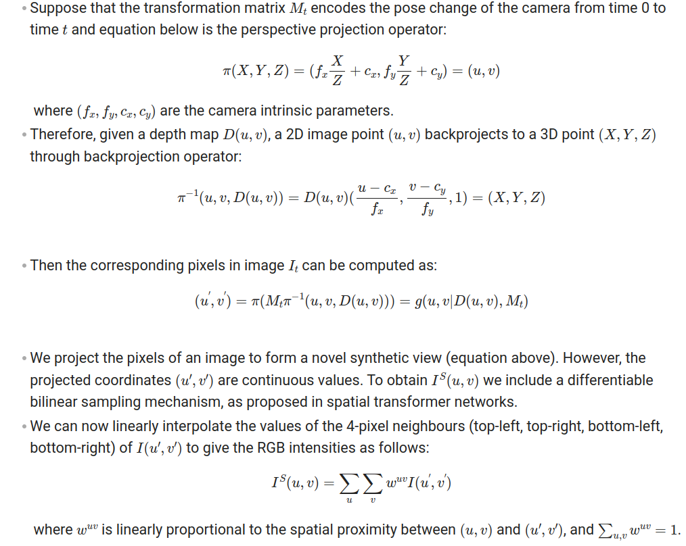
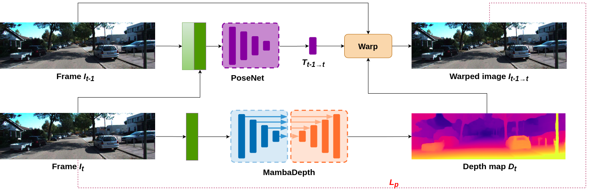
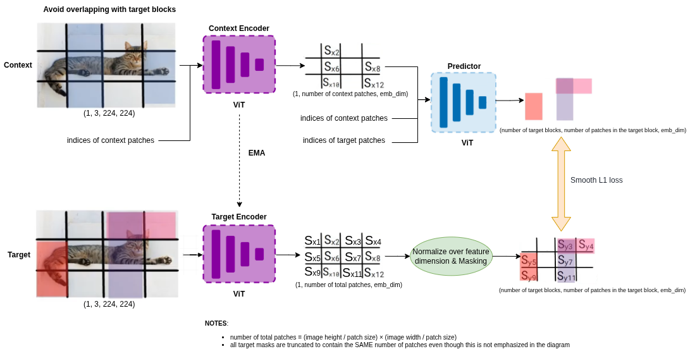

# JEPADepth


## Introduction
This is the implementation of the paper called "*JEPADepth: Some Title Here*".
<br />
<br />

If you find our work useful in your research please consider citing our paper:

```
@article{grigore2026jepadepth,
  title={JEPADepth: Some Title Here},
  author={Grigore, Ionuț and Popa, Călin-Adrian},
  journal={arXiv preprint arXiv:...},
  year={2026}
}
```

## Theoretical prerequisites
Fundamentally, self-supervised depth estimation is a form of Structure from Motion (SfM), where the monocular camera is moving within a rigid 
environment to provide multiple views of that scene. 

The seminal work in this field is "*Digging Into Self-Supervised Monocular Depth Estimation*" (https://arxiv.org/pdf/1806.01260.pdf) upon which 
almost every self-supervised depth estimation method/paper/repo is based on (also our repo).




<br />
Self-supervised framework:


## Instalation
Requirements: `Ubuntu 20.04`, `NVIDIA GPU`, `CUDA >= 11.7`

You'll probably find useful this documentation [Cuda-installation-guide-Linux](https://docs.nvidia.com/cuda/cuda-installation-guide-linux/index.html#conda-installation) and also
this:
```bash
conda install cuda -c nvidia
```

First create a conda environment called **jepadepth**:
```bash
conda create -n jepadepth  python=3.10  
```

Activate the new enviroment:
```bash
conda activate jepadepth
```

After that, run the following:
```bash
pip install -e .
```
or
```bash
pip install -e . && pip install -e ".[dev]"
```

Recommended to install the `[dev]` dependencies.

## KITTI training data
You can download the entire [raw KITTI dataset](https://www.cvlibs.net/datasets/kitti/raw_data.php) by running:
```bash
wget -i data/kitti/kitti_archives_to_download.txt -P data/kitti/kitti_data/
```
The **'-i'** option in wget stands for "input-file". <br />
This option specifies a file that contains a list of URLs to download.  <br />
In this case, the file is src/data/kitti/kitti_archives_to_download.txt.  <br />
This file should contain a list of URLs, each on a new line, pointing to the files that need to be downloaded. <br />

<br />

The **'-P'** option specifies the prefix (directory) where downloaded files will be saved. <br /> 
In this case, the files are being downloaded to the src/data/kitti/kitti_data/ directory. <br />

<br />
Then unzip with:

```bash
cd data/kitti/kitti_data
unzip "*.zip"
cd .. # 3 times
```
<br />

**Warning**: it weighs about 175GB, so make sure you have enough space to unzip too!
<br />

Their default settings expect that you have converted the png images to jpeg with this command, **which also deletes
the raw KITTI `.png` files**:
```bash
find data/kitti/kitti_data/ -name '*.png' | parallel 'convert -quality 92 -sampling-factor 2x2,1x1,1x1 {.}.png {.}.jpg && rm {}'
```
**or** you can skip this conversion step and train from raw png files by adding the flag `--png` when training, at the expense of slower load times.

The above conversion command creates images which match their experiments (see [Monodepth2](https://github.com/nianticlabs/monodepth2)), where KITTI `.png` images were converted to `.jpg` on Ubuntu 16.04 
with default chroma subsampling 2x2,1x1,1x1. They found that Ubuntu 18.04 defaults to 2x2,2x2,2x2, which gives different results, hence 
the explicit parameter in the conversion command.

## KITTI evaluation data

To prepare the ground truth depth maps, run the following command for your desired split:
```shell
# For Eigen split
python -m data.kitti.kitti_utils.export_gt_depth --data_path kitti_data --split eigen

# For Eigen Benchmark split
python -m data.kitti.kitti_utils.export_gt_depth --data_path kitti_data --split eigen_benchmark
```

This will generate `gt_depths.npz` files in the corresponding split directories (`data/kitti/kitti_splits/eigen/` or `data/kitti/kitti_splits/eigen_benchmark/`) containing the ground truth depth maps.

## Cityscapes evaluation data

The ground truth depth files for Cityscapes can be found at [HERE](https://storage.googleapis.com/niantic-lon-static/research/manydepth/gt_depths_cityscapes.zip).
Download this and unzip into `data/cityscapes`.

## Make3D evaluation data

We use the Make3D test set for evaluating our method (zero-shot evaluation), which could be downloaded from [here](http://make3d.cs.cornell.edu/data.html).
Download this and unzip into `data/make3d`.

You need to download:
- **Test134 images**: The 134 test images (`.jpg` files)
- **Test134 depths**: The corresponding ground truth depth maps (`.mat` files)

Our evaluation uses all 134 images from the Make3D test set for zero-shot depth estimation evaluation.


## Inference

```bash
python -m src.inference.test  
```

## Evaluation

**Note**: All evaluation settings (model paths, model settings, evaluation settings, etc.) are configured in `src/config/config.yaml`.

### KITTI evaluation 


The KITTI evaluation pipeline processes each test image through the trained depth model, applies optional post-processing (left-right consistency check) and median scaling, then computes both error metrics (abs_rel, sq_rel, rmse, rmse_log) and accuracy metrics (δ<1.25, δ<1.25², δ<1.25³) by comparing predictions against ground truth depth maps.

```bash
python -m src.evaluation.kitti_evaluation
```

### Cityscapes zero-shot evaluation


The Cityscapes zero-shot evaluation demonstrates the model's generalization capability by testing on urban driving scenes without any fine-tuning. The pipeline follows the same structure as KITTI evaluation but operates on Cityscapes' diverse city environments.

```bash
python -m src.evaluation.cityscapes_evaluation
```

### Make3D zero-shot evaluation


The Make3D zero-shot evaluation tests the model on outdoor scenes with different characteristics than KITTI. This evaluation only computes error metrics (abs_rel, sq_rel, rmse, rmse_log) as the Make3D dataset focuses on absolute depth accuracy rather than relative accuracy thresholds.

```bash
python -m src.evaluation.make3d_evaluation
```

## Training

All training parameters (model architecture, learning rate, batch size, etc.) are configured in `src/config/config.yaml`.

### Standard Training (Photometric Loss Only)

To start standard self-supervised depth training, run:
```bash
python -m src.train.trainer
```

### JEPA-Enhanced Training (Photometric + JEPA Loss)

For training with JEPA-style masked prediction learning, first enable it in `src/config/config.yaml`:
```yaml
use_jepa_training: True
```

Then run:
```bash
python -m src.train.trainer
```

JEPA training combines:
- **Photometric loss**: Traditional self-supervised depth learning from video
- **JEPA loss**: Masked region prediction for better visual representations

**For complete documentation, see [`IJEPA_COMPLETE_GUIDE.md`](IJEPA_COMPLETE_GUIDE.md)**

#### What is I-JEPA?



**I-JEPA (Image-based Joint-Embedding Predictive Architecture)** is a self-supervised learning method that learns semantic visual representations by predicting masked regions of an image in embedding space, rather than predicting pixels directly. Unlike traditional masked autoencoders that reconstruct pixel values, I-JEPA predicts abstract representations, which encourages the model to learn higher-level semantic features.

Our implementation integrates I-JEPA's masked prediction approach with traditional photometric depth estimation, combining geometric understanding from video sequences with semantic feature learning from masked prediction. This dual objective helps the encoder learn more robust representations that generalize better to unseen domains.

**For an intuitive explanation of JEPA, watch** [this excellent video](https://www.youtube.com/watch?v=6bJIkfi8H-E)

## Local overfit

The goal was to see if the JEPADepth architecture could be overfit on a small batch of samples—typically one, two, or five images.
The ability to overfit is a litmus test for model capacity, and visual aids, such as the rendering of predicted depth maps, were instrumental in evaluating the success. 
If overfitting was achieved with satisfactory visual confirmation, the next logical step involved deploying the entire training pipeline, utilizing the full dataset.
```bash
python -m src.overfit.local_trainer
```

## Jupyter notebooks

You can also find some useful jupyter notebooks which have the purpose of illustrating the functionality of main parts of this project.

## Contact us

Contact us: ionut.grigore@cs.upt.ro